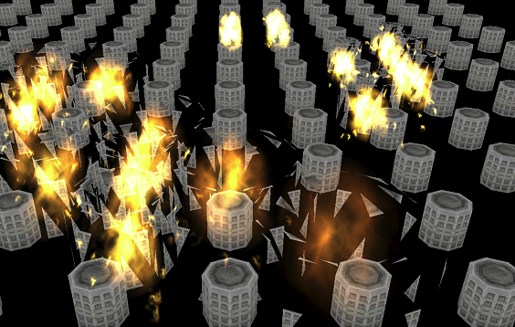

# Three.InstancedBreakObject

====

# Overview これは何？
Three.js用の追加クラス。指定した３Dオブジェクト（mesh,geometry）を、インスタンス化し、シェーダー上で「砕ける」表現を行います。 

  

## Demo

* [demo](http://adrs2002.com/sandbox/breakshader/index.html)
* [demo2](http://adrs2002.com/sandbox/breakshader/instansingtest.html)

## Requirement　必要なもの
* [THREE.js](https://github.com/mrdoob/three.js/)

--------

## how to use　使い方的な。

### 0. 'three.js(three.min.js)'　と　'threeBreakShader.js' の２つのjsファイルを読み込む文を追加する。  
  ( ･･･この説明は必要ないよね？）

### 1.砕かせたいオブジェクトを用意し、breakShaderを適用させます。
   mesh　と　geometry　が対応しています。

```
// mesh = any object

breakObject = new THREE.InstancedBreakObject(mesh);
scene.add(breakObject);
```   

### 2. 「砕ける」アニメーションを開始させます。

```
breakObject.beginBreak(); 
```

### 定義時オプション ( Constructor Option )

 プロパティ名| 型 | デフォルト値 |  説明  
  --- | --- | --- |  ---  
| **makeCount** | `int` | *1* | インスタンスの生成個数を指定します。 |  
| **positions** | `Vector3[]` | *[]* | 配置場所を指定します。makeCountと同じ個数でなかった場合、位置はXとZ位置はランダム、Y位置はゼロで固定されます。 |  
| **autoHidden** | `bool` | *true* | 破砕アニメーションの後、自動的に消去したままキープするかどうかを指定します。trueの場合、一度壊した後は自動的に消えた状態がキープされます。falseの場合、壊す前の初期状態に戻ります。  |  
| **gravity** | `float` |  *1.0* | 自動で加算される、重力の値を指定します。y軸のみに適用され、+の値の場合、徐々に下に下がります（つまり、-方向に加算されます）。 |  
| **scaleFactor** | `float` |  *1.0* | 生成オブジェクトの拡大縮小率を指定します。値は、XYZ軸全てに同じ値がセットされます。 |  
| **randomScale** | `bool` |  *false* | tureにした場合、0.1～scaleFactorの値の間で、大きさをランダムに変化させます。全軸がランダムに変化することになります。 |  

```

positions = [];
for(var i =0; i < 100; i++){
 positions.push( new THREE.Vector3().set(Math.random() * 100 -50, 0, Math.random() * 100 - 50) );
}

breakObject = new THREE.InstancedBreakObject(mesh, { makeCount : 100, positions : positions  });

```
------------- 

### メソッド

#### beginBreak

破砕アニメーションを開始します。

 プロパティ名| 型 | デフォルト値 |  説明  
  --- | --- | --- |  ---  
| **id** | `int` | *0* | 破砕させるオブジェクトの配列IDを指定します。 |  
| **force** | `bool` | *false* | アニメーションを強制的に発生させるかどうかを指定します。trueの場合、破砕アニメーションを最初から再生します。falseの場合、すでにアニメーション終了済み、または非表示状態であった場合は、破砕アニメーションを行いません。 |  

```
breakObject.beginBreak({id:0});
```

#### checkHits

Rayとの衝突判定を行います。衝突を検知した全ての配列のIDと、衝突点が返ります。

 返却プロパティ名| 型 | 説明  
  --- | --- | --- |  ---  
| **id** | `int` | 衝突を検知したオブジェクトの配列ID |  
| **o** | `Vector3` | 衝突点。 |  

```
const pos = new THREE.Vector3(mouseX, mouseY, 1);
      pos.unproject(camera);

const ray = new THREE.Raycaster(camera.position, pos.sub(camera.position).normalize());

const refs = breakObject.checkHits(ray);
 for (let i = 0; i < refs.length; i++) {
    breakObject.beginBreak({refs[i].id});
 }
```

#### checkHit

Rayとの衝突判定を行います。衝突を検知した中で、Rayの発信点から最も近い配列のIDと、衝突点が返ります。

 返却プロパティ名| 型 | 説明  
  --- | --- | --- |  ---  
| **id** | `int` | 衝突を検知したオブジェクトの配列ID |  
| **o** | `Vector3` | 衝突点。 |  

```
const pos = new THREE.Vector3(mouseX, mouseY, 1);
      pos.unproject(camera);

const ray = new THREE.Raycaster(camera.position, pos.sub(camera.position).normalize());

const ref = breakObject.checkHits(ray);
if(!ref){
    breakObject.beginBreak({ref.id});
    console.log(ref.o);
}
```


---------------------------------


## LICENCE
 MIT.
